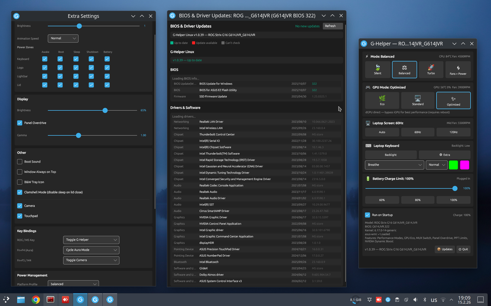

<p align="center">
  <a href="https://g-helper-linux.elevatech.xyz">
    
  </a>
</p>

<div align="center">

[](https://github.com/utajum/g-helper-linux/releases/latest)
[](https://github.com/utajum/g-helper-linux/releases)
[](https://github.com/utajum/g-helper-linux/releases)
[](https://github.com/utajum/g-helper-linux/blob/master/LICENSE)
[](CHANGELOG.md)
[](https://github.com/utajum/g-helper-linux/stargazers)

</div>

[](screenshot.png)

*Click on the screenshot to view full size.*

```
 ██████╗       ██╗  ██╗███████╗██╗     ██████╗ ███████╗██████╗ 
██╔════╝       ██║  ██║██╔════╝██║     ██╔══██╗██╔════╝██╔══██╗
██║  ███╗█████╗███████║█████╗  ██║     ██████╔╝█████╗  ██████╔╝
██║   ██║╚════╝██╔══██║██╔══╝  ██║     ██╔═══╝ ██╔══╝  ██╔══██╗
╚██████╔╝      ██║  ██║███████╗███████╗██║     ███████╗██║  ██║
 ╚═════╝       ╚═╝  ╚═╝╚══════╝╚══════╝╚═╝     ╚══════╝╚═╝  ╚═╝
                        ██╗     ██╗███╗   ██╗██╗   ██╗██╗  ██╗ 
                        ██║     ██║████╗  ██║██║   ██║╚██╗██╔╝ 
                        ██║     ██║██╔██╗ ██║██║   ██║ ╚███╔╝  
                        ██║     ██║██║╚██╗██║██║   ██║ ██╔██╗  
                        ███████╗██║██║ ╚████║╚██████╔╝██╔╝ ██╗ 
                        ╚══════╝╚═╝╚═╝  ╚═══╝ ╚═════╝ ╚═╝  ╚═╝ 
 ░░░░░░░░░░░░░░░░░░░░░░░░░░░░░░░░░░░░░░░░░░░░░░░░░░░░░░░░░░░░░░░░
         ╔══[ SYSTEM ]════════════════════════════════╗
         ║  >_ KERNEL: LINUX                          ║ 
         ║  >_ STATUS: ONLINE...                      ║
         ╚═══════════════════════════════[ 0x1F4 ]════╝
           ╔══════════════════════════════════════╗
           ║  ASUS LAPTOP CONTROL FOR LINUX       ║
            ╚══════════════════════════════════════╝
```

<!-- star-history:start -->
<picture>
  <source media="(prefers-color-scheme: dark)" srcset="assets/star-history/star-history-dark.svg">
  
</picture>
<!-- star-history:end -->

## `░▒▓█ ╔══[ WEBSITE ]══╗ █▓▒░`

**[g-helper-linux.elevatech.xyz](https://g-helper-linux.elevatech.xyz)**

---

## `░▒▓█ ╔══[ MOTIVATION ]══╗ █▓▒░`

Since `asusctl` doesn't really care about Ubuntu, I decided to port most functionality from the original [G-Helper](https://github.com/seerge/g-helper) for Windows.

The application is tested on KDE but other desktop environments should also work.

Pull requests and feature requests are welcome!

---

<div align="center">

[](https://buymeacoffee.com/utajum)

</div>

---

## `░▒▓█ ╔══[ FEATURES ]══╗ █▓▒░`

```
┌──────────────────────────────────────────────────────────────────┐
│  Performance modes         Silent / Balanced / Turbo            │
│  Custom fan curves         8-point drag-to-edit per fan         │
│  Battery charge limit      Protect longevity (40-100%)          │
│  GPU mode switching        Eco / Standard / Optimized (MUX)     │
│  Power limits              CPU PL1/PL2, Dynamic Boost, temps    │
│  Screen control            Refresh rate, Panel OD, MiniLED      │
│  Keyboard backlight        Brightness + RGB (per-key Aura)      │
│  Display                   Brightness, gamma, multi-backend     │
│  Undervolting              AMD Curve Optimizer, Intel MSR       │
│  CPU boost + EPP           Turbo boost, energy preference       │
│  Audio DSP                 EQ, noise suppression, reverb        │
│  Anime Matrix / Slash      LED matrix display control           │
│  ROG Ally                  Controller mode, handheld config     │
│  FnLock remapping          Custom Fn key bindings               │
│  NumberPad                 Trackpad numpad emulation             │
│  Mouse / peripherals       DPI, polling, Logitech HID++         │
│  System monitor            CPU/GPU/RAM dashboard + tray stats   │
│  Self-updater              In-app update check + changelog      │
│  System tray               Background tray icon + context menu  │
│  Auto-start                XDG autostart .desktop integration   │
└──────────────────────────────────────────────────────────────────┘
```

Experimental Lenovo support (IdeaPad / Legion / LOQ / Yoga): performance modes, battery conservation, fan monitoring, PPT limits and keyboard backlight via the mainline ideapad-laptop and lenovo-wmi kernel drivers (kernel 6.17+ for power limits).

---

## `░▒▓█ ╔══[ GPU MODE SWITCHING ]══╗ █▓▒░`

G-Helper manages the ASUS dGPU (discrete GPU) power state and MUX switch through four modes:

```
╔══[ MODES ]═════════════════════════════════════════════════════╗
║                                                                 ║
║  Eco         dGPU powered off (dgpu_disable=1)                 ║
║              Maximum battery life, iGPU only                    ║
║                                                                 ║
║  Standard    Hybrid mode (dgpu_disable=0, MUX=iGPU)            ║
║              dGPU available for offloading, iGPU drives display ║
║                                                                 ║
║  Optimized   Auto-switch based on power source                  ║
║              Eco on battery, Standard on AC power               ║
║                                                                 ║
║  Ultimate    dGPU direct (dgpu_disable=0, MUX=dGPU)            ║
║              Best performance — dGPU drives display directly    ║
║                                                                 ║
╚═════════════════════════════════════════════════════════════════╝
```

### `╠══[ REBOOT REQUIREMENTS ]══╣`

| Transition | Reboot? | Why |
|------------|---------|-----|
| Eco ↔ Standard | Usually no | May need reboot if GPU driver is active |
| Any → Ultimate | **Yes** | MUX switch is latched, takes effect on reboot |
| Ultimate → Any | **Yes** | MUX switch back to iGPU requires reboot |

When a reboot is required, G-Helper shows a notification and the pending mode appears in the UI. You can change your mind before rebooting — clicking a different mode cancels the pending change.

### `╠══[ DRIVER BLOCKING DIALOG ]══╣`

Switching to Eco while the dGPU driver is active shows a dialog with three options:

- **Switch Now** — attempts to unload the dGPU driver (requires admin password)
- **After Reboot** — saves the mode for next boot (dGPU driver is blocked from loading via modprobe rules)
- **Cancel** — keeps the current mode

### `╠══[ KNOWN LIMITATIONS ]══╣`

- **Ultimate → Eco** may require 2 reboots (MUX must change first, then Eco can apply)
- **MUX switch support** varies by model — requires `gpu_mux_mode` sysfs attribute
- **Eco mode** may require a reboot if the dGPU driver holds a DRM file descriptor
- On boot, a systemd oneshot service applies pending GPU mode changes before the display manager starts

### `╠══[ RAW WMI MODE (EXPERIMENTAL) ]══╣`

For 2020-2021 laptops without `dgpu_disable` sysfs, G-Helper supports raw ACPI/WMI calls
via the kernel's debugfs interface. See **[docs/raw-wmi.md](docs/raw-wmi.md)** for details.

### `╠══[ UNDERVOLTING (AMD RYZEN) ]══╣`

Curve Optimizer undervolting for AMD Ryzen CPUs via the [ryzen_smu](https://github.com/amkillam/ryzen_smu) kernel driver. Requires the driver to be installed separately. The feature is hidden unless the driver is loaded and the CPU is supported. See **[docs/amd-undervolting.md](docs/amd-undervolting.md)** for setup, supported CPUs, and details.

---

## `░▒▓█ ╔══[ DISCLAIMER ]══╗ █▓▒░`

```
╔══[ TERMS OF USE ]══════════════════════════════════════════════╗
║                                                                 ║
║  G-Helper Linux interacts directly with ASUS firmware via       ║
║  kernel sysfs attributes and ACPI/WMI methods. These are the   ║
║  same interfaces used by ASUS Armoury Crate on Windows.         ║
║                                                                 ║
║  BY USING THIS SOFTWARE, YOU ACKNOWLEDGE:                       ║
║                                                                 ║
║  1. This software writes to hardware control registers that     ║
║     affect GPU power state, fan speeds, power limits, and       ║
║     MUX switch configuration.                                   ║
║                                                                 ║
║  2. Incorrect or interrupted writes (e.g., power loss during    ║
║     a MUX switch) could leave hardware in an unexpected state.  ║
║     In rare cases, a CMOS reset may be needed to recover.       ║
║                                                                 ║
║  3. Experimental features (marked as such) bypass normal        ║
║     kernel safety checks and should only be enabled if you      ║
║     understand the risks.                                       ║
║                                                                 ║
║  4. This software is provided AS-IS with no warranty.           ║
║     The authors are not responsible for hardware damage.        ║
║                                                                 ║
╚═════════════════════════════════════════════════════════════════╝
```

---

## `░▒▓█ ╔══[ SYSTEM REQUIREMENTS ]══╗ █▓▒░`

```
╔══[ MINIMUM SPEC ]══════════════════════════════════════════════╗
║                                                                 ║
║  OS       Ubuntu 22.04+ / Debian 12+ / Fedora 38+ / Arch      ║
║  Desktop  X11 or Wayland (X11 recommended for full xrandr)     ║
║  Kernel   6.2+ recommended, 6.9+ for all features              ║
║  Module   asus-nb-wmi (loaded by default on ASUS laptops)      ║
║                                                                 ║
╚═════════════════════════════════════════════════════════════════╝
```

```bash
# verify kernel module
lsmod | grep asus
# expected: asus_nb_wmi, asus_wmi
```

### `╠══[ KERNEL FEATURE MATRIX ]══╣`

| Feature | Min Kernel |
|---------|-----------|
| Performance modes, fan speed, battery limit | 5.17 |
| Custom fan curves (8-point) | 5.17 |
| PPT power limits (PL1, PL2, FPPT) | 6.2 |
| GPU MUX switch | 6.1 |
| NVIDIA Dynamic Boost / Temp Target | 6.2 |
| MiniLED mode control | 6.9 |

---

## `░▒▓█ ╔══[ INSTALLATION ]══╗ █▓▒░`

### `╠══[ ONE-LINER INSTALL ]══╣`

```bash
curl -sL https://raw.githubusercontent.com/utajum/g-helper-linux/master/install/install.sh | sudo bash
```

### `╠══[ QUICK UNINSTALL ]══╣`

```bash
curl -sL https://raw.githubusercontent.com/utajum/g-helper-linux/master/install/install.sh | sudo bash -s -- --uninstall
```

Removes system files + udev rules + desktop entry. User config in `~/.config/ghelper` is preserved.

### `╠══[ MANUAL DOWNLOAD ]══╣`

```bash
curl -sL https://github.com/utajum/g-helper-linux/releases/latest/download/ghelper -o ghelper
chmod +x ghelper
./ghelper
```

### `╠══[ APPIMAGE ]══╣`

```bash
curl -sL https://github.com/utajum/g-helper-linux/releases/latest/download/GHelper-x86_64.AppImage -o GHelper-x86_64.AppImage
chmod +x GHelper-x86_64.AppImage
./GHelper-x86_64.AppImage
```

### `╠══[ BUILD FROM SOURCE ]══╣`

```bash
# Ubuntu/Debian
sudo apt install dotnet-sdk-10.0 clang zlib1g-dev upx-ucl libpipewire-0.3-dev pkg-config

# Fedora
sudo dnf install dotnet-sdk-10.0 clang zlib-devel upx pipewire-devel pkg-config

# Arch
sudo pacman -S dotnet-sdk clang upx libpipewire pkg-config
```

```bash
# Check for outdated NuGet packages
cd src && dotnet list package --outdated
```

```bash
./build.sh
sudo ./install/install-local.sh
```

<details>
<summary><code>╠══[ MANUAL BUILD COMMANDS ]══╣</code></summary>

```bash
# Development (JIT, fast iteration)
cd src && dotnet restore && dotnet run

# GHELPER_DEV=1 shows a "Dev Windows" button in the main window to open any app window without the matching hardware
GHELPER_DEV=1 dotnet run

# Production (Native AOT)
cd src && dotnet publish -c Release
# → src/bin/Release/net10.0/linux-x64/publish/ghelper
```

</details>

---

## `░▒▓█ ╔══[ INSTALL TARGETS ]══╗ █▓▒░`

```
╔══[ DEPLOYED FILES ]════════════════════════════════════════════╗
║                                                                 ║
║  0xF0  Binary     /opt/ghelper/ghelper                         ║
║  0xF1  Symlink    /usr/local/bin/ghelper                       ║
║  0xF2  udev       /etc/udev/rules.d/90-ghelper.rules          ║
║  0xF3  Desktop    /usr/share/applications/ghelper.desktop      ║
║  0xF4  Autostart  ~/.config/autostart/ghelper.desktop          ║
║                                                                 ║
╚═════════════════════════════════════════════════════════════════╝
```

`install.sh` downloads the release binary. `install-local.sh` uses the local build from `dist/`.

```bash
# reload udev after install (or reboot)
sudo udevadm control --reload-rules && sudo udevadm trigger
```

<details>
<summary><code>╠══[ MANUAL SETUP ]══╣</code></summary>

```bash
# udev rules
sudo cp install/90-ghelper.rules /etc/udev/rules.d/
sudo udevadm control --reload-rules && sudo udevadm trigger

# Desktop entry + autostart
sudo cp install/ghelper.desktop /usr/share/applications/
mkdir -p ~/.config/autostart
cp install/ghelper.desktop ~/.config/autostart/
```

</details>

---

## `░▒▓█ ╔══[ CONFIGURATION ]══╗ █▓▒░`

```
~/.config/ghelper/config.json
```

Same JSON key format as Windows G-Helper — fan curves and mode settings are compatible.

---

## `░▒▓█ ╔══[ PROJECT STRUCTURE ]══╗ █▓▒░`

```
g-helper-linux/
  build.sh                                # Build script (Native AOT)
  install/
    install.sh                            # Download + install (end users)
    install-local.sh                      # Install from local build (devs)
    90-ghelper.rules                      # udev rules
    ghelper.desktop                       # Desktop entry
  vendor/
    gpu-helper/                           # Native C helper (setuid root)
      gpu-helper.c                        #   Main entry + CLI dispatch
      nvidia_ops.c                        #   NVML process scan, refcnt, MPS
      pci_ops.c                           #   PCI power control, DRM unbind
      wmi_ops.c                           #   ACPI/WMI raw calls
      ec_ops.c                            #   ASUS EC manual fan duty
      msr_ops.c                           #   Intel MSR undervolting
      process_ops.c                       #   Process kill for GPU holders
      lenovo_ops.c                        #   Lenovo WMI fan/thermal
    ryzenadj/                             # AMD SMU power tuning (bundled)
    wlr-randr/                            # Wayland display backend (bundled)
  audio-helper/                           # Native C PipeWire DSP helper
    main.c                                #   Real-time audio frame I/O
    protocol.h                            #   Shared frame protocol with C#
    rnnoise/                              #   RNNoise noise suppression lib
  scripts/
    i18n-check.sh                         # Translation key validation
    kernel-check.sh                       # Upstream kernel feature tracking
    upstream-check.sh                     # Windows G-Helper upstream diff
  tests/
    GHelper.Linux.Tests/                  # C# scenario tests
  docs/
    raw-wmi.md                            # Raw ACPI/WMI mode (2020-2021)
    amd-undervolting.md                   # AMD Curve Optimizer setup
  src/
    Program.cs                            # Entry point
    App.axaml / App.axaml.cs              # Avalonia app + tray icon + lifecycle
    GHelper.Linux.csproj                  # Project file (.NET 10.0, AOT)
    Helpers/
      AppConfig.cs                        # Configuration (JSON, AOT-safe)
      Logger.cs                           # Console logger
      AudioHelper.cs                      # PipeWire DSP bridge (audio-helper)
      AudioFrame.cs                       # Native frame protocol structs
      CommandIpc.cs                       # Single-instance IPC
      Diagnostics.cs                      # System info dump
      NativeLibExtractor.cs               # Embedded binary extraction
      SystemTelemetry.cs                  # CPU/RAM/temp monitoring
      TraySystemMonitor.cs                # Tray tooltip telemetry
    Mode/
      Modes.cs                            # Performance mode definitions
      ModeControl.cs                      # Mode change orchestrator
    Battery/
      BatteryControl.cs                   # Charge limit + battery info
    Fan/
      FanSensorControl.cs                 # Multi-sensor fan curve logic
      FanHysteresis.cs                    # Hysteresis smoothing
    Gpu/
      GPUModeControl.cs                   # Eco/Standard/Ultimate orchestrator
      NVidia/
        LinuxNvidiaGpuControl.cs          #   NVML + nvidia-smi monitoring
        NvidiaProcessScanner.cs           #   dGPU holder scan (proc/NVML/MPS)
        GpuQueryGate.cs                   #   Circuit breaker for wedged dGPU
      AMD/
        LinuxAmdGpuControl.cs             #   amdgpu hwmon sysfs
        LinuxAmdDgpuDetect.cs             #   AMD dGPU presence detection
        LinuxAmdGpuMetrics.cs             #   GPU metrics table parsing
    Display/
      LinuxDisplayControl.cs              # Brightness, gamma, refresh rate
      DisplayBackendFactory.cs            # Auto-detect display backend
      XrandrBackend.cs                    # X11 xrandr
      WlrRandrBackend.cs                  # wlroots Wayland
      KScreenBackend.cs                   # KDE Wayland
      GdctlBackend.cs                     # GNOME display control
      MiniLed.cs                          # MiniLED zone control
      OptimalBrightness.cs                # Ambient-adaptive brightness
    Input/
      InputDispatcher.cs                  # Hotkey routing + FnF5 debounce
      EvdevInterop.cs                     # Raw evdev P/Invoke
      FnLockRemapper.cs                   # Fn-lock key remapping
      GamepadNav.cs                       # Gamepad UI navigation
      MKeyControl.cs                      # M-key macro support
      NumberPad.cs                        # Trackpad numpad emulation
      OskUinput.cs                        # On-screen keyboard uinput
    I18n/
      Labels.cs                           # Translation key registry
      Languages/                          # 38 language files
    Install/
      Installer.cs                        # Self-install / system file sync
    Ally/
      AllyControl.cs                      # ROG Ally handheld controller
      ControllerMode.cs                   # Gamepad / desktop mode toggle
    AnimeMatrix/
      AniMatrixControl.cs                 # Anime Matrix LED display
      AnimeMatrixDevice.cs                # HID protocol
      SlashDevice.cs                      # Slash LED display
    Peripherals/
      PeripheralsProvider.cs              # Device discovery
      Mouse/                              # Mouse DPI / polling config
      Logitech/                           # Logitech HID++ protocol
    USB/
      AsusHid.cs                          # ASUS HID protocol
      Aura.cs                             # Aura RGB lighting
      CustomRgb.cs                        # Per-key RGB
      LenovoRgb.cs                        # Lenovo keyboard RGB
    Platform/
      IHardwareControl.cs                 # Hardware abstraction interfaces
      Linux/
        SysfsHelper.cs                    # Core sysfs read/write utility
        LinuxPowerManager.cs              # CPU boost, platform profile, EPP
        LinuxAudioControl.cs              # PulseAudio/PipeWire volume
        LinuxInputHandler.cs              # evdev event forwarding
        LinuxSystemIntegration.cs         # DMI sysfs, XDG autostart
        Asus/
          LinuxAsusWmi.cs                 #   asus-wmi sysfs + ACPI events
          AsusAttributes.cs               #   Firmware attribute discovery
          StatusLed.cs                    #   Status LED control
        Lenovo/
          LinuxLenovoWmi.cs               #   Lenovo WMI platform driver
          LenovoAttributes.cs             #   Lenovo sysfs attributes
          LenovoDetection.cs              #   Model detection + quirks
        RyzenSmu.cs                       # AMD Curve Optimizer (ryzen_smu)
        IntelUndervolt.cs                 # Intel MSR undervolting
        CpuEpp.cs                         # Energy Performance Preference
        Cosmic.cs                         # COSMIC DE integration
        NixOS.cs                          # NixOS-specific paths
        ImmutableOs.cs                    # Fedora Atomic / SteamOS quirks
    UI/
      Styles/
        GHelperTheme.axaml                # Dark theme
      Controls/
        FanCurveChart.cs                  # Interactive fan curve chart
        EqResponseView.cs                 # EQ frequency response
        KnobControl.cs                    # Audio knob widget
        WaveformView.cs                   # Audio waveform display
        SpectrumView.cs                   # Audio spectrum analyzer
      Dialogs/
        ConfirmDialog.axaml               # Reusable confirm dialog
      Views/
        MainWindow.axaml / .cs            # Main settings window
        FansWindow.axaml / .cs            # Fan curves + power limits
        ExtraWindow.axaml / .cs           # Display, power, system info
        AudioWindow.axaml / .cs           # Audio device routing
        EqWindow.axaml / .cs              # Parametric equalizer
        NoiseWindow.axaml / .cs           # RNNoise suppression
        ReverbWindow.axaml / .cs          # Reverb effect
        VocoderWindow.axaml / .cs         # Vocoder effect
        MonitorWindow.axaml / .cs         # System monitor dashboard
        HandheldWindow.axaml / .cs        # ROG Ally / handheld config
        MatrixWindow.axaml / .cs          # Anime Matrix editor
        FnLockWindow.axaml / .cs          # FnLock key config
        MouseWindow.axaml / .cs           # Mouse/peripheral settings
        NvidiaProcessesWindow.axaml / .cs # dGPU process viewer
        UpdatesWindow.axaml / .cs         # Self-updater
        SystemInfoWindow.axaml / .cs      # System info viewer
      Assets/
        Icons/                            # SVG icon library
        *.ico                             # Tray + window icons
```

---

## `░▒▓█ ╔══[ ARCHITECTURE ]══╗ █▓▒░`

| Windows (G-Helper) | Linux (this port) |
|---|---|
| `\\.\ATKACPI` DeviceIoControl | `/sys/devices/platform/asus-nb-wmi/` sysfs |
| DSTS (read) / DEVS (write) | `cat` / `echo >` sysfs attributes |
| WMI `Win32_*` queries | `/sys/class/dmi/id/` sysfs |
| `user32.dll` EnumDisplaySettings | xrandr / wlr-randr / kscreen / gdctl (auto-detect) |
| NvAPIWrapper.Net | gpu-helper (NVML) + nvidia-smi fallback |
| `atiadlxx.dll` (AMD ADL) | amdgpu hwmon sysfs + gpu-helper PCI ops |
| NAudio / CoreAudio | audio-helper (PipeWire native C, real-time DSP) |
| Task Scheduler autostart | XDG `~/.config/autostart/*.desktop` |
| WinForms UI | Avalonia UI (cross-platform) |

---

## `░▒▓█ ╔══[ CREDITS ]══╗ █▓▒░`

- [G-Helper](https://github.com/seerge/g-helper) by seerge
- [Avalonia UI](https://avaloniaui.net/)
- [asus-wmi kernel driver](https://github.com/torvalds/linux/tree/master/drivers/platform/x86)
- [ryzen_smu](https://github.com/amkillam/ryzen_smu) by Leonardo Gates / amkillam
- [RyzenAdj](https://github.com/FlyGoat/RyzenAdj) by FlyGoat (bundled CLI binary for AMD SMU power tuning)
- [RNNoise](https://github.com/xiph/rnnoise) by Jean-Marc Valin / Xiph.Org (noise suppression)
- [PipeWire](https://pipewire.org/) (native audio DSP pipeline)

---

## `░▒▓█ ╔══[ LICENSE ]══╗ █▓▒░`

Same license as the original G-Helper project.

---

<div align="center">

[](https://buymeacoffee.com/utajum)

```
  ░▒▓█ END OF TRANSMISSION █▓▒░
  > SESSION_END :: 0x00000000
```

</div>
